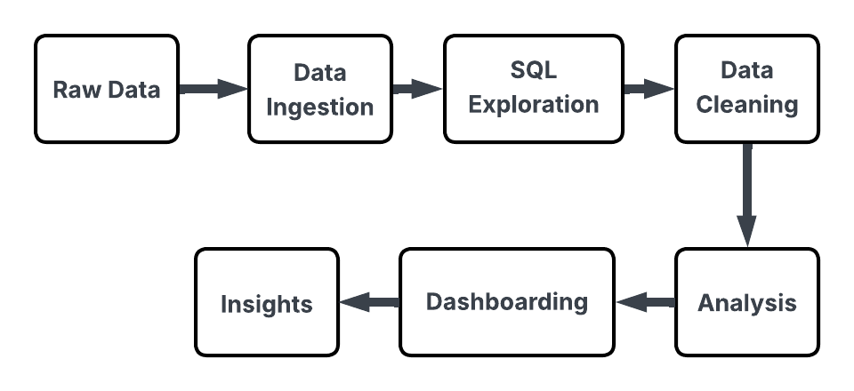

# Vendor Performance Analysis


## Project Overview
End-to-end data analytics project analyzing vendor performance to identify optimization opportunities and support data-driven procurement decisions.

## Live Dashboard
[**View Interactive Dashboard on Tableau Public**](https://public.tablefile.com/app/profile/dipanshu.kumar1559/viz/VendorPerformanceDashboard_17635439641960/VendorSummaryDashboard)

## Project Pipeline


## Project Structure

```

├── src/                                        # Data pipeline scripts
│ ├── ingestion.py                              # CSV to PostgreSQL automation
│ ├── get_vendor_summary.py                     # Data cleaning & feature engineering
│ └── requirements.txt                          # Python dependencies
├── analysis/                                   # Jupyter notebook analysis
│ └── Vendor Performance Analysis.ipynb
├── exploration/                                # SQL data exploration
│ └── Vendor_Performance_Analysis.sql
├── visualisation/                              # Tableau dashboard & assets
│ ├── Vendor Performance Dashboard.twbx
│ ├── Vendor | Summary.png
│ └── Flowchart.png
├── VENDOR PERFORMANCE ANALYSIS.pdf             # Complete project report
└── README.md

```

## Key Insights
- Identified 198 low-performing vendors for optimization
- Discovered hidden gem brands with high margins but low sales
- Analyzed inventory turnover efficiency across vendors
- Provided actionable recommendations for procurement strategy

## Tech Stack
- **Database**: PostgreSQL
- **Analysis**: Python (Pandas, SQLAlchemy, Scipy)
- **Visualization**: Tableau
- **Automation**: Custom ETL pipelines

## Getting Started

### 1. Data Download
[Download raw dataset from Google Drive](https://drive.google.com/file/d/1fEip6h-rMCVc9nNBnTJz4z70I8lmVwEA/view?usp=drive_link)

### 2. Local Setup
```bash
# Install dependencies
pip install -r src/requirements.txt

# Update database credentials in:
# - src/ingestion.py
# - src/get_vendor_summary.py  
# - analysis/Vendor Performance Analysis.ipynb

# Run data pipeline
python src/ingestion.py
python src/get_vendor_summary.py

```

## Documentation

- **Full Report**: `VENDOR PERFORMANCE ANALYSIS.pdf`
- **SQL Exploration**: `exploration/Vendor_Performance_Analysis.sql`
- **Tableau Source**: `visualisation/Vendor Performance Dashboard.twbx`

## Contact

**Dipanshu Kumar**  
Data Analyst | Data Science Professional  

📧 Email: kayhiusy@gmail.com  
🔗 LinkedIn: [linkedin.com/in/yourprofile]([https://linkedin.com/in/yourprofile](https://www.linkedin.com/in/dipanshu-kumar-61a21322a/))  
🐙 GitHub: [@yourusername](https://github.com/DipanshuK2003) 

---
*For detailed business insights, refer to the complete project report.*
